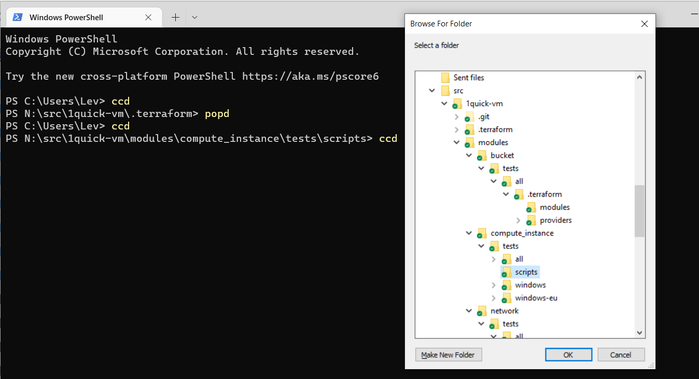

# Useful/[Control-WinApps](control-winapps/Control-WinApps.ps1)

A very neat script that I found on [github.com/sergueik/powershell_selenium](https://github.com/sergueik/powershell_selenium/blob/master/powershell/button_selenium.ps1).

It implements the following Windows classes: `WinAPI`, `Win32WindowEvents`, and some UI elements, such as `Win32Window`, `Win32CheckBox`, `Win32Label`, `Win32ListBox`, `Win32TextBox`, `Win32Button`.

`WinAPI` and `Win32WindowEvents` are particularly useful, because they enable interaction with other Windows applications, directly from PowerShell, using the Windows API.

Usage:

```powershell
./Control-WinApps.ps1
$window = [System.Windows.Win32Window]::FromProcessName("explorer")
$window.Hwnd
```

# Useful/[PS-WinHelpers](ps-winhelpers/_PS-WinHelpers.ps1)

A collection of useful PowerShell functions and classes that I use in my scripts, such as:
* Wrappers around built-in PowerShell functions, for making them more efficient. (eg. the registry functions)
* Others are re-implementaitons of PowerShell DSC functionality (eg. `Install-Font`, `New-Shortcut`, etc.). Desired State Configuration is, regrettably, suprisingly unsuable on desktops, because it requires admin to run and needs the user's credentials.
* Other useful functions like logger, checking for admin rights, etc.

### Overview

| Function                         | Description                                                                            |
| -------------------------------- | -------------------------------------------------------------------------------------- |
| IsAdmin                          | Returns true if the current user is an administrator.                                  |
| Invoke-ToAdmin                   | Restarts the current script as administrator                                           |
| Install-ModuleIfNotPresent       | Installs a module if it's not already installed.                                       |
| Get-ScriptPath                   | Returns the path of the current script.                                                |
| Write-DebugLog                   | Writes a message to the debug log, detects function name and stack depth automatically |
| Start-SleepOrKey                 | Sleeps for the specified amount of time, or until a key is pressed.                    |
| Start-SleepUntilTrue             | Pause execution until a condition is met or a timeout is reached.                      |
| Get-SubstedPaths                 | Get a Hashtable of the currently Substed drives                                        |
| Get-RealPath                     | Returns the real path of a file or folder if the current path is on a substed drive    |
| Get-Timestamp                    | Returns a timestamp string in the format "yyyyMMdd-HHmmss"                             |
| Get-RegValue                     | Reads a value from the registry.                                                       |
| Set-RegValue                     | Writes a value to the registry.                                                        |
| Register-PowerShellScheduledTask | Registers a PowerShell script as a scheduled task.                                     |
| New-Shortcut                     | Creates a .lnk shortcut. Added workaround for unicode.                                 |
| Set-ShellStaticVerb              | Sets a static verb for a file extension.                                               |
| Invoke-SHChangeNotify            | Notifies the shell of changes and a refresh is needed.                                 |
| New-FileAssoc                    | Creates a new file association.                                                        |
| New-FileAssocExt                 | Creates a new file association, extended function.                                     |
| Get-EnvPathsArr                  | Returns the %PATH% environment variable as an array, supports User and Machine scopes  |
| Add-UserPaths                    | Adds a list of paths to the current user's %PATH% environment variable.                |
| Remove-UserPaths                 | Removes a list of paths from the current user's %PATH% environment variable.           |
| Update-PathsInShell              | Updates the %PATH% environment variable in the current shell.                          |
| Get-ExeVersion                   | Returns the version information of an executable.                                      |
| Set-FolderComment                | Sets a Windows Explorer comment on a folder. (not fully working)                       |
| Install-Font                     | Installs a font from a file for the current user.                                      |
| Get-DropboxInstallPath           | Returns the path of the Dropbox data sync folder.                                      |
| Get-StreamContent                | Returns the content of an NTFS stream as a string.                                     |
| Set-DropboxIgnoredPath           | Sets a path to be ignored by Dropbox                                                   |
| Get-DropboxIgnoredPath           | Checks if a path is ignored by Dropbox.                                                |


# Useful/Scripts
Useful scripts that I always like to have around, preferably in `$PATH`.

## [Add-UserPath.ps1](scripts/Add-UserPath.ps1)

Adds a path to the current user's `%PATH%` environment variable.

Relative path will be resolved before adding.

Useful, for example, for adding the current folder to the path.

```powershell
Add-UserPath .

Add-UserPath c:\tools\scripts
```

## [ccd.ps1](scripts/ccd.ps1)

A replacement for the `cd` command in certain cases.

It opens a Windows Forms folder picker, and changes the current directory to whatever is selected.

Handy when you're in a deep directory structure, so you don't have to do many `dir`s and `cd`s.

After chaning the location, you can go back to the previous path with `popd` (The script uses `Push-Location` in the background.)

```powershell
ccd
# do stuff..
popd
```




## [code..cmd](scripts/code..cmd) / [code..sh](scripts/code..sh)

Launches VS Code in the current folder when you mistyped `code.` instead of `code .`

```powershell
code.
```

## [code.ps1]

Resolves the path of $args[0] if it's on a substed drive, so that Git Gutters will work properly.

```powershell
code .
```

## [ConEmu.cmd](scripts/ConEmu.cmd)

Opens a ConEmu shell in the current folder, or the specified directory. (Similar to `code .`)

```powershell
ConEmu

ConEmu .

ConEmu /src/MyProject
```

## [gRefreshToken.ps1](scripts/gRefreshToken.ps1)

Generates a fresh GCP OAUTH token and drops it in the current git repo's root as `token.secret`

It's a convention that I use in my projects.

```powershell
gRefreshToken
```

## [k.cmd](scripts/k.cmd)

Kubectl alias for Windows.

```powershell
k get pods
```

## [ll.cmd](scripts/ll.cmd)

`ls -l` alias for Windows.

```powershell
ll

ll /
```

## [mk.cmd](scripts/mk.cmd)

`minikube` + `minikube kubectl` alias for Windows.

If the first parameter is specific to `minikube`, it will run `minikube %*`.

Otherwise, it assumes it's a `kubectl` command, and runs `minikube kubectl -- %*`.

```powershell
mk start
mk get pods
```

## [Refresh-Path.ps1](scripts/Refresh-Path.ps1)

Refresh `$env:PATH` in the current shell to whatever is set in Registry.

Useful when new apps have been installed, and you don't want to close your existing shells.

```powershell
Refresh-Path
```

## [Toggle-TarkMode.ps1](scripts/Toggle-DarkMode.ps1)

Toggles Windows 10's Dark Mode.

```powershell
Toggle-TarkMode
```

## [watch.cmd](scripts/watch.cmd)

`watch` alias for Windows.

Set `%DELAY%` for a custom delay, default is 3 seconds.

```powershell
set DELAY=5
watch dir c:\
```

# Useful/Regs

Useful registry files that I like to have around.
